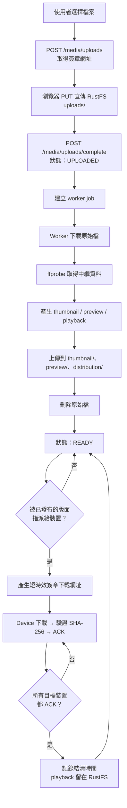

這一章描述一個檔案從上傳到派送完成的完整過程，以及 HUAN 在儲存上刻意做的取捨。

## 完整流程

## 儲存命名空間

RustFS 裡的物件依用途分成幾個前綴：

| 前綴            | 內容                         | 保留策略           |
| --------------- | ---------------------------- | ------------------ |
| `uploads/`      | 使用者上傳的原始檔           | 轉檔成功後立即刪除 |
| `processing/`   | Worker 的中間產物            | 工作結束即刪除     |
| `thumbnail/`    | 素材庫縮圖                   | 長期保留（很小）   |
| `preview/`      | 後台排版預覽用的低解析度版本 | 長期保留           |
| `distribution/` | 派送到裝置的播放檔           | 長期保留           |

**物件鍵一律由 UUID 組成，永遠不使用使用者提供的檔名。**

資料夾只存在於資料庫（`media_folders` 是一棵自我參照的樹，上限 8 層），**不影響物件鍵**。把素材搬到另一個資料夾只是改一個 `folder_id` 欄位，RustFS 上什麼都沒有動，裝置也不會因此重新下載任何檔案。

一個叫 `../../etc/passwd.mp4` 的上傳檔案不會變成路徑問題，因為那個名字只會被存成中繼資料裡的一個字串，從來不會出現在物件鍵裡。副檔名由 content type 推導，不是從檔名擷取。

## 為什麼原始檔會被刪除

一支 4K 的原始影片可能有 8 GB。轉檔後的 1080p 播放檔可能只有 200 MB。如果原始檔永久保存，物件儲存的成本會隨著上傳量線性成長，而那些原始檔在系統裡沒有任何用途——播放用的是轉檔後的版本，預覽用的是預覽版本。

所以 HUAN 在轉檔成功後就刪除原始檔。這是刻意的產品決定，理由完整寫在 [ADR-0003](/huan/dev/adr/0003-temporary-object-storage)。

## 為什麼播放產物不再被回收

早期的 HUAN 會在所有目標裝置 ACK 並過了保留期之後，把 `distribution/` 的播放檔一起回收，理由和刪除原始檔一樣：正式副本已經在裝置本機了。

這個取捨在實際使用後被推翻，因為它換來的東西比省下的空間貴：

- **後台挑素材要靠預覽。** 「哪一支影片」從 `宣傳片_final_v3` 是看不出來的，必須看得到畫面。
- **隨時可能多一台裝置。** 新的門市、換過的機器、清掉本機儲存的裝置，都需要同一份 playback。已經回收的素材在那一刻就變成不能用。
- **播放檔本來就不大。** 1080p、30fps、CRF 21 的成品是幾百 MB 等級，而原始母帶才是 GB 等級的那一個。

現在 `thumbnail/`、`preview/` 與 `distribution/` 都長期留在 RustFS。`media_variants` 的 `distribution_settled_at` 仍然記錄「所有目標裝置都 ACK 的時刻」，但它只是派送進度的紀錄，不再觸發任何刪除。

## 需要重新上傳

`NEEDS_REUPLOAD` 是舊回收機制留下的狀態：那些素材的原始檔與播放產物都已經不在了，RustFS 上沒有可以派送的版本。後台會直接這樣顯示，不會假裝檔案還在、等到派送時才失敗。

新上傳的素材**不會再落到這個狀態**。既有的資料仍然看得到它，解法一樣是重新上傳同一個檔案。

資料模型本身就表達得出這件事：每個 `media_variants` 資料列都有 `available` 欄位，物件不在時轉為 `false`，資料列保留下來，讓 UI 能解釋素材為什麼需要重新上傳。轉檔成功後被刪掉的 `original` 走的也是同一條路。

## 影片轉檔目標

目標是產生「小、通用、Raspberry Pi 也放得動」的檔案。

| 項目       | 設定                             |
| ---------- | -------------------------------- |
| 容器       | MP4                              |
| 視訊       | H.264（High profile, level 4.0） |
| 像素格式   | `yuv420p`                        |
| 最大解析度 | 1920×1080                        |
| 最大影格率 | 30 fps                           |
| 音訊       | AAC                              |
| Fast start | 啟用（`-movflags +faststart`）   |

**不做放大。** 一支 640×360 的來源檔轉出來還是 640×360，把它拉成 1080p 只會讓檔案變大、畫質不變。長寬比一律保持原樣。

`yuv420p` 是刻意指定的：某些來源使用 `yuv444p` 或 10-bit 格式，Raspberry Pi 的硬體解碼器不支援，播放時會退回軟體解碼並卡頓。

## 圖片處理

圖片上傳後同樣產生三種產物。播放版本會限制在合理尺寸——不能讓 Raspberry Pi 每次算繪都去解一張 12000×9000 的原圖。

長寬比保持不變。來源含有 alpha 通道時，播放版本會保留透明資訊，不會被壓成黑底。

## HTML

第一版只支援**單一自帶資源的 HTML 檔案**。需要圖片時請用 `data:` URI 內嵌。完整的網站 ZIP 代管不在這一版的範圍內。

上傳的 HTML 在裝置上以 sandbox iframe 執行，沒有 Node、沒有檔案系統、沒有 Electron API。詳見 [Device 架構](/huan/dev/device)。
