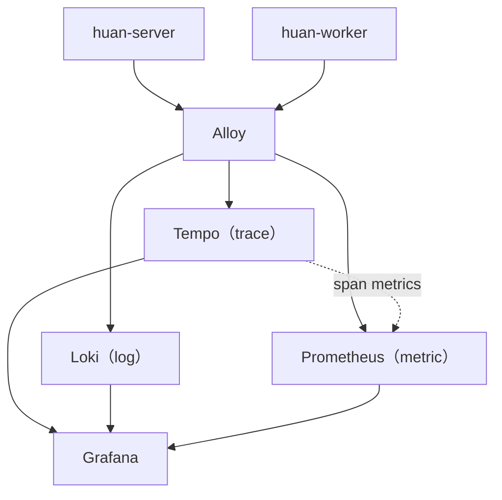

Server 與 Worker 以 OpenTelemetry 送出三種訊號：

| 訊號   | 內容                                                                       | 存在哪裡   | 保留  |
| ------ | -------------------------------------------------------------------------- | ---------- | ----- |
| trace  | 每個 API 請求、每支轉檔工作，以及裡面的每一段資料庫查詢、S3 呼叫與轉檔步驟 | Tempo      | 14 天 |
| log    | 原本就印在 stdout 的 pino 日誌，多帶上 `trace_id`                          | Loki       | 30 天 |
| metric | 請求延遲分布、Node.js 執行環境，以及裝置、素材、工作佇列的業務指標         | Prometheus | 90 天 |

三者在 Grafana 裡互相連結：從一行 log 點 `trace_id` 開那筆 trace，從 trace 看同一時間的 log，從延遲圖上的點跳到造成那個延遲的 trace。

為什麼選這個架構見 [ADR-0009](/huan/dev/adr/0009-opentelemetry)。

## 啟用

沒有設定收件端時 SDK 完全不載入，HUAN 照常運作。要啟用只需要環境變數：

| 變數                          | 範例                                     | 說明                                        |
| ----------------------------- | ---------------------------------------- | ------------------------------------------- |
| `OTEL_EXPORTER_OTLP_ENDPOINT` | `https://huan-otlp.example.com`          | **設定了才啟用。** OTLP/HTTP 收件端的根網址 |
| `OTEL_EXPORTER_OTLP_PROTOCOL` | `http/protobuf`                          | 預設就是這個，寫出來比較不會被誤改          |
| `OTEL_RESOURCE_ATTRIBUTES`    | `deployment.environment.name=production` | 區分正式與開發環境；儀表板用它篩選          |
| `OTEL_EXPORTER_OTLP_HEADERS`  | `authorization=Bearer …`                 | 收件端需要驗證時才設                        |
| `OTEL_SDK_DISABLED`           | `true`                                   | 臨時關掉，不必刪掉其他設定                  |
| `HUAN_VERSION`                | commit SHA                               | 映像建置時自動帶入，成為 trace 上的服務版本 |

其餘標準的 `OTEL_*` 變數（例如 `OTEL_SERVICE_NAME`、`OTEL_TRACES_SAMPLER`）SDK 也都認得。

SDK 由 `node --import` 在應用程式之前載入，Docker 映像已經用 `NODE_OPTIONS` 設好，不需要改啟動指令。同一個容器裡的 migration 與健康檢查也會經過它，但只有主程式會真的啟動 SDK。

## 儀表板

「HUAN 服務總覽」在 Grafana 的 HUAN 資料夾，由上而下：

| 區塊         | 回答的問題                                                                       |
| ------------ | -------------------------------------------------------------------------------- |
| 總覽         | 現在每秒多少請求、5xx 錯誤率、p95 延遲、幾台裝置在線、有沒有轉檔失敗、佇列卡住沒 |
| API 請求     | 各狀態碼的請求量、延遲走勢、最慢的端點；表格列出每個路由的請求數、錯誤率與延遲   |
| 慢請求與錯誤 | 超過門檻的請求、失敗的請求與工作（點進去看 trace），以及 warn 以上的日誌         |
| 資料庫與 S3  | 哪一種查詢最慢、每秒查幾次（N+1 會在這裡現形）、RustFS 回應時間                  |
| 轉檔 Worker  | 每種工作與每個步驟的耗時、成功與失敗次數、佇列長度                               |
| 裝置         | 在線與離線台數；每台裝置有沒有落後目標版本、有沒有儲存錯誤、多久沒回報           |
| 執行環境     | event loop 延遲、heap、GC                                                        |
| 日誌         | 各等級的日誌量，以及可以用關鍵字搜尋的全部日誌                                   |

儀表板的 JSON 在 `docker/observability/grafana/`，以檔案 provisioning 載入。要改就改那份 JSON，在 Grafana 介面裡的修改不會被保存。

## 查一個慢請求

1. 在「各 API 端點」表格按 p95 排序，找到變慢的路由。
2. 到「慢請求」表格調整上方的門檻，找到那個路由的某一筆 trace，點 trace ID。
3. trace 會攤開成瀑布圖：HTTP 請求底下是每一段資料庫查詢（`SELECT media_assets`）與 S3 呼叫（`S3.GetObject`），各自花了多久一目了然。
4. 如果每一段都不長、加起來卻很長，看「執行環境」的 event loop 延遲——通常是有同步工作把整個 process 卡住。
5. 在 trace 上點「Logs for this span」看那個請求當下印了什麼。

轉檔工作一樣：`worker.job process_image` 底下是下載、分析、產生播放圖、上傳等每一步。

## 不會記錄的東西

trace 與 log 會保留好幾週、給所有看得到 Grafana 的人看，因此以下資料一律不送出：

- **查詢字串**：可能帶著簽章或 token。trace 的 `url.query` 永遠是空的，log 的網址也先去掉查詢字串。
- **配對碼**：`/pairing/<配對碼>` 在 trace 與 log 裡都記成 `/pairing/***`。
- **SQL 參數**：資料庫 span 只記 SQL 樣板（`where "id" = $1`），不記綁定的值。
- **請求與回應的標頭、內文**：cookie、Authorization、密碼、TOTP、復原碼都在這裡面。
- **程序的命令列參數**：預設的資源偵測器會把它貼到每一筆 log 上，HUAN 只取主機名稱與環境變數。

新增埋點時也要守這些規則。日誌本來就有 pino 的 `redact` 設定與 `req` 序列化器把關；trace 則是在 `@huan/telemetry` 與 `@huan/db` 的 tracing 模組裡處理。

## 加上自己的 span

HTTP、pino、AWS SDK 與資料庫查詢都是自動的。業務流程想多切幾段，用 `@opentelemetry/api`：

```ts
import { trace } from "@opentelemetry/api";

const tracer = trace.getTracer("huan-worker");

await tracer.startActiveSpan("產生縮圖", async span => {
	try {
		await makeThumbnail();
	} finally {
		span.end();
	}
});
```

Worker 的 `runStep()` 已經幫每個步驟開好 span，新增步驟時不必自己寫。span 名稱要是有限的幾種（「產生縮圖」），不要把 ID 放進名稱——ID 放在 attribute 裡，否則每一筆都會變成一條新的指標。

資料庫查詢只在有上層 span 時才追蹤。背景統計（業務指標每 30 秒查一次資料庫）不屬於任何請求，追蹤它只會製造一堆沒有意義的單段 trace。

## 在本機試

最省事的做法是把本機的 Server 與 Worker 接到一個已經在跑的收件端：

```sh
export OTEL_EXPORTER_OTLP_ENDPOINT=http://127.0.0.1:4318
export OTEL_RESOURCE_ATTRIBUTES=deployment.environment.name=development
pnpm dev
```

收件端可以用 `docker/observability/compose.yaml` 自己起一組，需要搭配一個 Grafana，細節見該目錄的 `README.md`。

:::note[Node 26 的淘汰警告]

在 Node 26 上啟用時會看到 `DEP0205`（`module.register()` 已淘汰）。那是 ESM 模組攔截用的 API，容器用的 Node 24 沒有這個警告，功能也不受影響；升級到 Node 26 時再換成 `registerHooks`。

:::

## 後端

正式環境的後端是 Alloy 收件、Tempo／Loki／Prometheus 各存一種訊號，Grafana 讀這三者：



Tempo 會從 trace 算出每個 span 的次數與延遲分布寫進 Prometheus，所以「哪一種查詢最慢」、「哪個轉檔步驟最慢」不必在程式裡另外埋指標，也永遠跟 trace 對得上。

收件端本身沒有驗證，不能直接開在公網上；正式環境經 Cloudflare Tunnel 對外，並以 Cloudflare Access 只放行 HUAN 主機的 IP。
